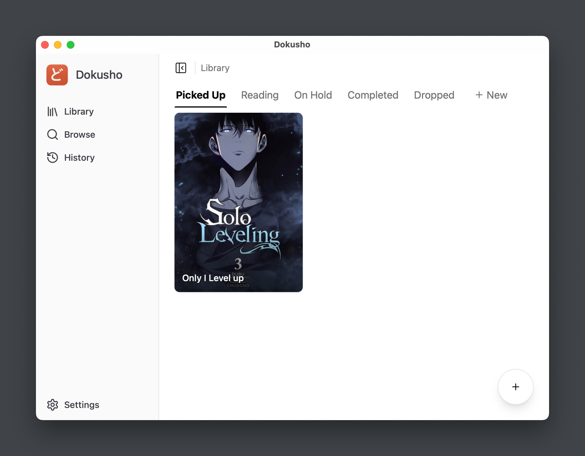

# Dokusho

<div align="center">
  
  <h3>Modern manga reader built with Tauri and React</h3>

[](https://www.gnu.org/licenses/gpl-3.0)

[](https://tauri.app)
[](https://reactjs.org/)
</div>

<div align="center">
  
</div>

## 📖 Overview

[Dokusho](https://dokusho.app) is a modern, cross-platform manga reader application that provides a seamless reading experience with library management features. Built with performance and user experience in mind, it leverages Tauri's native capabilities while providing a beautiful React interface. Visit our website at [dokusho.app](https://dokusho.app) for more information.

## ✨ Features

- 📚 Comprehensive manga library management
- 🔄 Multiple reading modes (left-to-right, right-to-left, vertical, webtoon)
- 🎨 Customizable reading experience (zoom, padding, layouts)
- 🗂️ Custom categories with drag-and-drop organization
- 📱 Cross-platform support (Windows, macOS, Linux)
- 🚀 Fast, native performance with small app size
- 📂 Support for folder and CBZ imports
- 🎨 Dark and light mode support
- 📱 Responsive design for various screen sizes

## 📥 Installation

### Pre-built Binaries

Download the latest release for your platform:

| Platform | Download |
|----------|----------|
| Windows | [Dokusho_0.1.1_x64.msi](https://github.com/uday-samsani/dokusho/releases/download/v0.1.1/Dokusho_0.1.1_x64.msi) |
| macOS | [Dokusho_0.1.1_universal.dmg](https://github.com/uday-samsani/dokusho/releases/download/v0.1.1/Dokusho_0.1.1_universal.dmg) |
| Linux | [dokusho_0.1.1_amd64.deb](https://github.com/uday-samsani/dokusho/releases/download/v0.1.1/dokusho_0.1.1_amd64.deb) |

For all available downloads and older versions, visit the [releases page](https://github.com/uday-samsani/dokusho/releases).

### Building from Source

#### Prerequisites

- [Node.js](https://nodejs.org/) (v18 or higher)
- [Rust](https://www.rust-lang.org/tools/install) (latest stable)
- [pnpm](https://pnpm.io/installation) (v8 or higher)

#### Development Setup

1. Clone the repository:
   ```bash
   git clone https://github.com/uday-samsani/dokusho.git
   cd dokusho
   ```

2. Install dependencies:
   ```bash
   pnpm install
   ```

3. Run the development server:
   ```bash
   pnpm tauri dev
   ```

#### Building for Production

```bash
pnpm tauri build
```

This will create platform-specific installers in the `src-tauri/target/release/bundle` directory.

## 🛠️ Tech Stack

- **Frontend**:
    - [React](https://reactjs.org/)
    - [Tailwind CSS](https://tailwindcss.com/) with [shadcn/ui](https://ui.shadcn.com/) components
    - [Jotai](https://jotai.org/) for state management
    - [dnd kit](https://dndkit.com) for drag-and-drop functionality

- **Backend**:
    - [Tauri](https://tauri.app/) (Rust-based native framework)
    - [Rust](https://www.rust-lang.org/)

- **Build Tools**:
    - [Vite](https://vitejs.dev/)
    - [pnpm](https://pnpm.io/) (Package manager)

## 📋 Release History

| Version | Date | Changes |
|---------|------|---------|
| 0.1.1   | Apr 24, 2025 | - Bug fixes for library import<br>- Improved category management<br>- Fixed reader navigation in double-page mode |
| 0.1.0   | Apr 10, 2025 | Initial beta release |

## 📅 Roadmap

| Feature | Target Release | Status |
|---------|----------------|--------|
| Online extension system | v0.2.0 | 🔄 In Progress |
| Reading progress sync | v0.2.0 | 📅 Planned |
| Advanced library search | v0.3.0 | 📅 Planned |
| Customizable theming | v0.3.0 | 📅 Planned |
| Cloud sync | v0.4.0 | 📅 Planned |
| Mobile app | v1.0.0 | 📅 Planned |

## 🤝 Contributing

We welcome contributions to Dokusho! Please check our [Contributing Guide](CONTRIBUTING.md) for more details.

1. Fork the repository
2. Create your feature branch (`git checkout -b feature/amazing-feature`)
3. Commit your changes (`git commit -m 'Add some amazing feature'`)
4. Push to the branch (`git push origin feature/amazing-feature`)
5. Open a Pull Request

## 🐛 Issue Reporting

If you encounter any bugs or issues, please [create an issue](https://github.com/uday-samsani/dokusho/issues/new) with the following information:
- Detailed description of the problem
- Steps to reproduce
- Expected behavior
- Screenshots (if applicable)
- Your environment (OS, device, app version)

## 🔗 Links

- [Official Website](https://dokusho.app)
- [GitHub Repository](https://github.com/uday-samsani/dokusho)
- [Issue Tracker](https://github.com/uday-samsani/dokusho/issues)
- [Release Notes](https://github.com/uday-samsani/dokusho/releases)
- [Download Page](https://dokusho.app/download)

## 📄 License

[](http://www.gnu.org/licenses/gpl-3.0.en.html)

<div align="left">

You may copy, distribute and modify the software as long as you track changes/dates in source files. Any modifications to or software including (via compiler) GPL-licensed code must also be made available under the GPL along with build & install instructions.

</div>

## ⚠️ DMCA Disclaimer

<div align="left">

The developers of this application do not have any affiliation with the content available in the app. It collects content from sources that are freely available through any web browser.

</div>

---

<div align="center">
  <p>Built with ❤️ by the Dokusho team</p>
  <p>© 2025 <a href="https://dokusho.app">Dokusho</a></p>
</div>